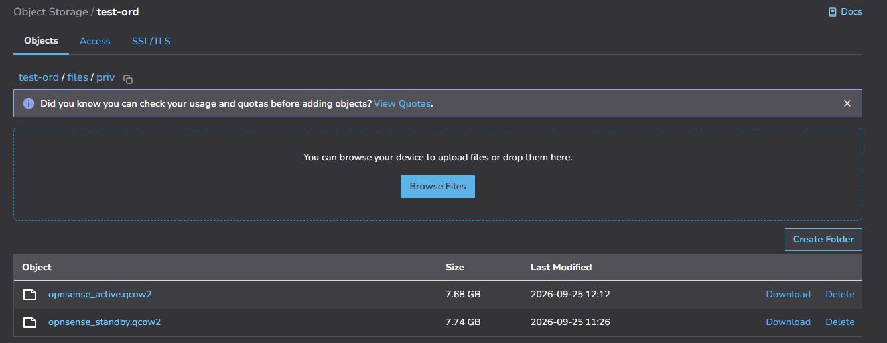
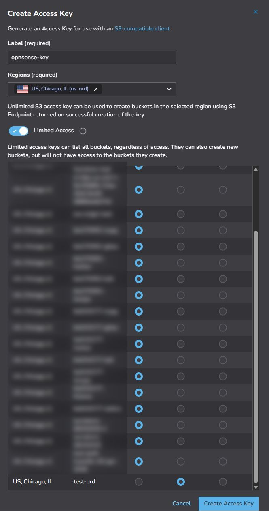
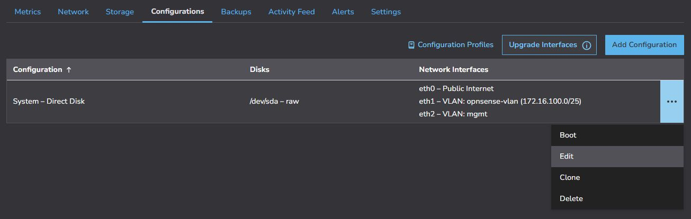

# OPNSense Installation

# Overview

This repo provides a starting point for deploying OPNSense on Linode.  The deployment creates HA pairs of appliances in a region of your choosing.  The HA works through a floating IP (it uses the IP of the primary instance as the shared public IPv4).  The instance has a VLAN subnet on eth1 that you can use to connect to your VLAN where your workload instances.  The instance has a management VLAN on eth2 to facilitate configuration sync and heartbeat between the HA pair.

The high level process to deploy is as follows (before proceeding, review the detailed steps in the next section):

1. Clone this repo and verify the configuration options in `opnsense.config`.  This file controls aspects of the deployment such as region, compute instance size, and the CIDR range of your VLAN.
2. Upload the image files to your own object storage bucket on your account and setup an access key.
3. Create and export an access token in your shell environment where you will run the script.
4. Run the `opnsense_ha_deploy.sh` script which will provision the HA pair on your account.
5. Add a Cloud Firewall to your appliances to limit access as needed after the script deploy is complete.
6. Login to your appliances via https://<your_ip_address>:8087

# Detailed Deployment Steps

## Step 1 — Setup Images in Object Storage

1. Download these images to your local computer
    1. [https://test-ord.us-ord-1.linodeobjects.com/files/priv/opnsense_active.qcow2](https://test-ord.us-ord-1.linodeobjects.com/files/priv/opnsense_active.qcow2)
    2. [https://test-ord.us-ord-1.linodeobjects.com/files/priv/opnsense_standby.qcow2](https://test-ord.us-ord-1.linodeobjects.com/files/priv/opnsense_standby.qcow2)
2. Decide on the region that you will be deploying OPNSense in and create a bucket and location in Object Storage on your account to host the images.
    1. The bucket and folder should be private (the script does a check on the access key and secret to ensure the permissions are read-only to this specific bucket).
    2. Upload the images you downloaded in step 1 to this new bucket and folder you have created on your account.  The example
    of what my bucket looks like after uploading them is shown below.

    

3. Create an Access Key that has read-only permissions to the bucket where your images are located.  In my example, I have a bucket called `test-ord` where my images are stored in Chicago and the key that I create is specifically permissioned to that bucket with read-only permissions.
    
    
    
4. Update your `opnsense.config` with the following configurations based on the steps above:
    1. `active`
    2. `standby`
    3. `bucket_region`
    4. `bucket_key`
    5. `bucket_secret`

## Step 2 — Setup an API Access Key

1. While logged into Cloud Manager go to [https://cloud.linode.com/profile/tokens](https://cloud.linode.com/profile/tokens)
2. Create a new access token with full permissions.  It will be used to call various APIs to configure the appliances on your account.  You can delete the token after deployment
3. Save this token somewhere you can reference it later.  You’ll export it in your shell session before running the deployment script.

## Step 3 — Configure Deployment Script

1. Edit the `opensense.config` file in your text editor of choice (e.g. `vi`)
2. Update the config values to reflect your choices for deployment.  Specify the region, the type and size of instance you want, the name and CIDR for the VLAN on eth1, etc.  
    1. NOTE:  Everything can be reconfigured in the future after deployment.  The script is mostly just setting up defaults as a starting point.
3. Don’t forget to save your updates.

## Step 4 — Run the Deployment Script

1. Open a shell session (this was tested in Bash) and navigate to this cloned repo
2. Ensure `opnsense_ha_deploy.sh` has execute permissions.
3. Export your API token as `export token="ABC123XYZ"`
4. Execute `opnsense_ha_deploy.sh`
5. If any errors occur there will be generated log files as well as detailed output in the console.  The script will take several minutes to run and will indicate completion when done.  If successful you will see two instances in Cloud Manager with the label in their name that you set in your config.
    1. NOTE: you will see messages such as "Linode busy or rate limited" as well as "API error" in some cases.  There are built-in retry mechanisms for certain conditions that are known to occur during deployment so this is normal.
6. Once they are in your account deployed, they take about 10-15 minutes to finish initial setup.  There’s a cloud-init script that runs to bootstrap them.

## Step 5 — Login and Change the Root Password

1. You can login to the instances at https://<floating_ip>:8077
    1. NOTE:  you will get a certificate error in the browser that you will need to allow / override to login.
    2. The floating_ip will be the public IPv4 of your primary instance.
    3. The default password is `L1n0d3` so be sure to change this

## Step 6 — Setup a Cloud Firewall

1. The HA pair does not yet have a [Cloud Firewall](https://cloud.linode.com/firewalls) attached so you should create one that restricts the web management port only to your IP addresses (or if you have a jump host you can restrict it to traffic coming from that host).  You can add whatever other rules make sense for your deployment.

## Step 7 — Reconfiguring / Updates

- The instances are deployed with a default image from 2025.  You may want to software updates or other configuration changes.
- If you want to make networking changes you will need to coordinate changes you make to the VLAN networking in Cloud Manager with changes in the OPNSense console.   These instances use Config Profile Networking, so networking changes would be initially made in the Configuration Profile as shown below.  You could then make updates in the OPNSense Console, and then reboots would be required for changes to take effect.
    
    
    
- You can also work with the OPNSense shell interface through [Lish Console](https://techdocs.akamai.com/cloud-computing/docs/access-your-system-console-using-lish) in case you ever make a mistake and lose access to the web UI through a mishap in configuration changes (e.g. networking updates, Cloud Firewall, etc.)